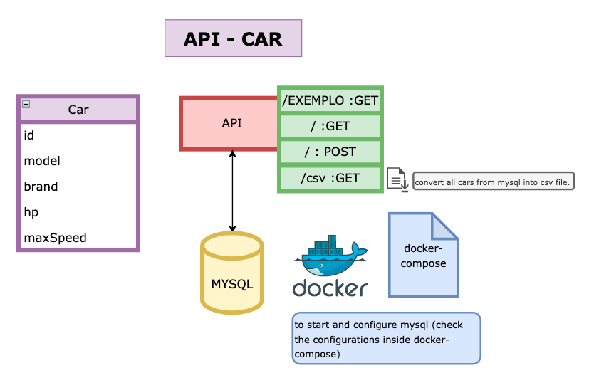

# api-car-spring-crud
Creating simple API with Spring Boot and Mysql

How to execute:

1. Create MySQL database on Docker: Access resources folder on terminal and run docker-compose up. 
You can check username, database and password on docker-compose.yaml.
2. Run SpringBoot project
3. The API will be available on http://localhost:8080/

To create a car: 

POST :/
{
"model": "enzo",
"brand": "ferrari",
"hp": 550,
"maxSpeed": 350
}

To get example data:

GET :/exemplo

To get all cars in CSV format:

GET :/csv